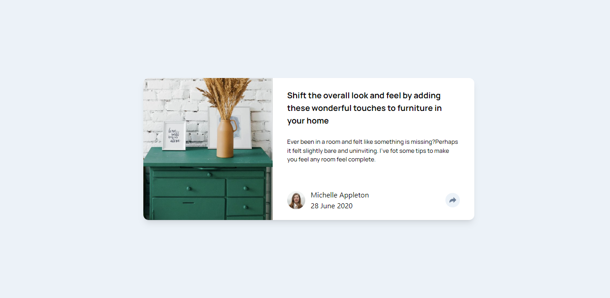

# Article preview component solution

A challenge by FrontEnd Mentor

## Table of contents

  - [Screenshot](#screenshot)
  - [Links](#links)
  - [My process](#my-process) 
  - [Built with](#built-with)
  - [Author](#author)

### Screenshot
  
  

### Links

- Live Site URL: [Article Preview](https://newt-article-preview.netlify.app/)

## My process

-Mobile first approach.
-Flex

### Built with

- Semantic HTML5 markup
- CSS custom properties
- Flexbox
- CSS Grid
- Mobile-first workflow
- Vite + React
- [tailwindcss](https://tailwindcss.com)

## Author

- Frontend Mentor - [@newton-w](https://www.frontendmentor.io/profile/newton-w)
- LinkedIn- [@Newton](https://www.linkedin.com/in/newton-warui-326917223/)

